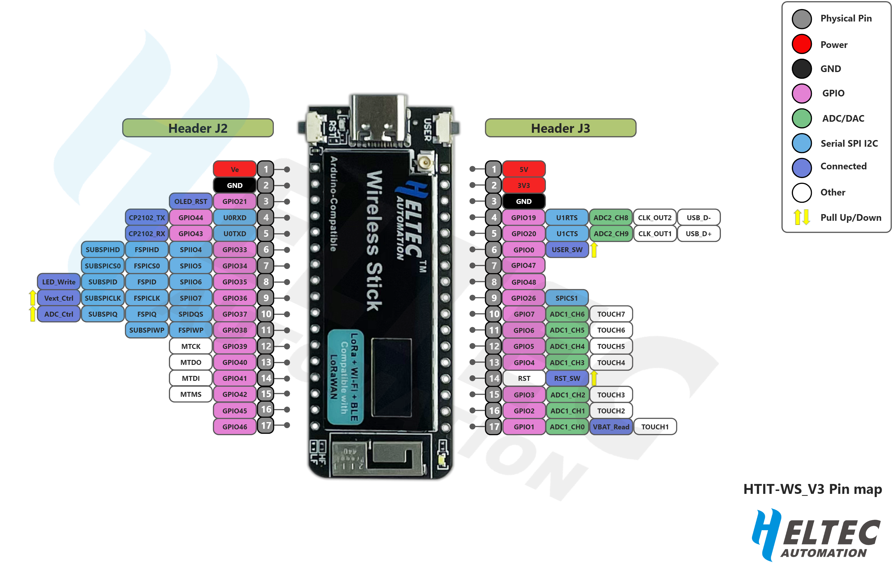

# ROV SOURCE CODE
Big ol repo for all the code used in the ROV club (or most of it, idk where elliot's code is)

## __INFO ABT THE NEW FLOAT BOARD__

  - Using Thonny IDE
  - Running on ESP32-S3 MicroPython (Link to download page: https://micropython.org/download/ESP32_GENERIC_S3/)
  - Guide to install MicroPython on it: https://wiki.heltec.org/docs/devices/open-source-hardware/esp32-series/three-platform/Micropython
  - Chip is SX1262
  - uPy lib for chip: https://github.com/git512/micropySX126X 

## __What Pins Do What?__
  - GPIO 35: Onboard White LED
  - scl pin is 18
  - sda pin is 17
  - SS (CS)= 8
  - SCK (CLK)= 9
  - MOSI = 10
  - MISO = 11
  - RST = 12
  - BUSY = 13
  - DIO (also irq) = 14

